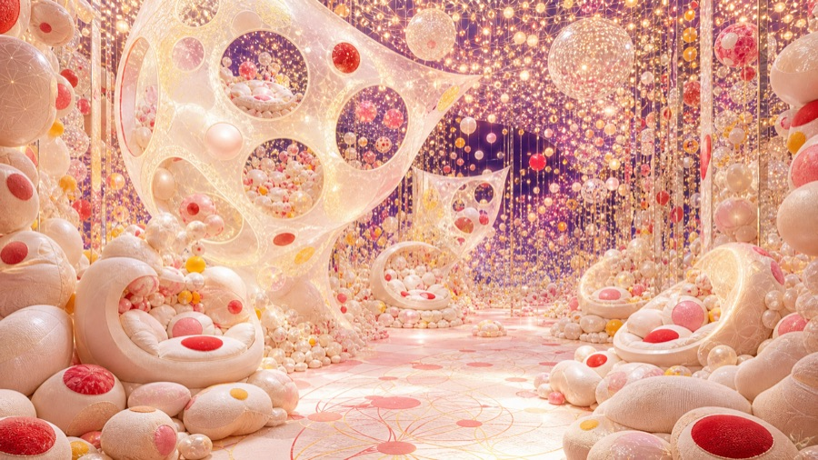
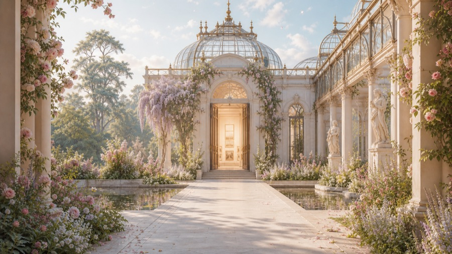
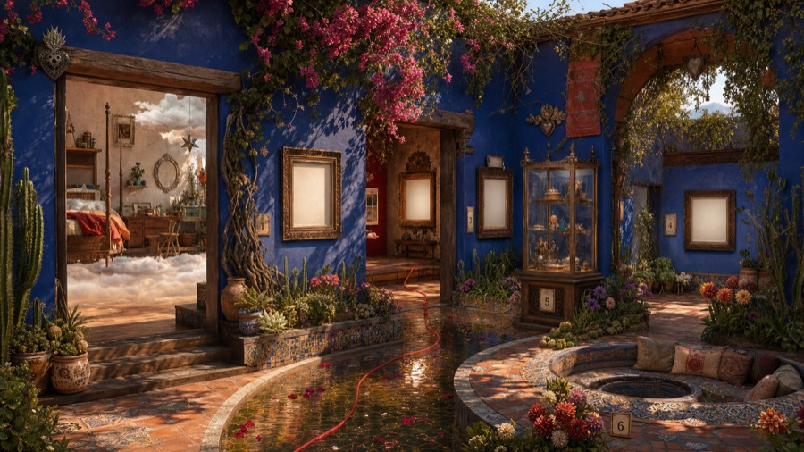
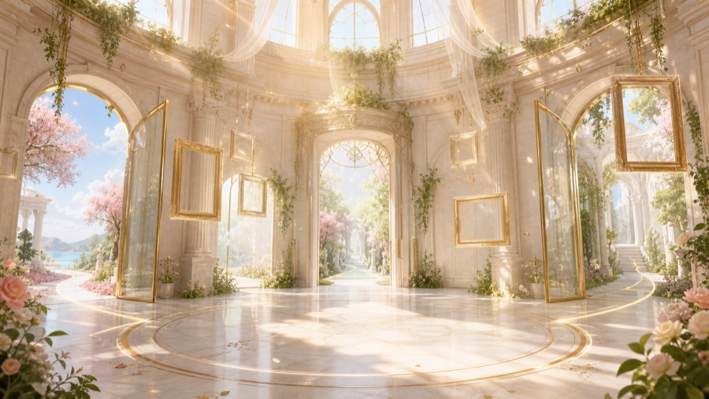
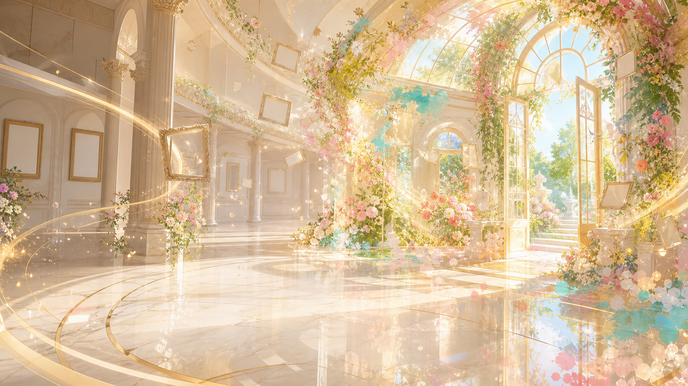
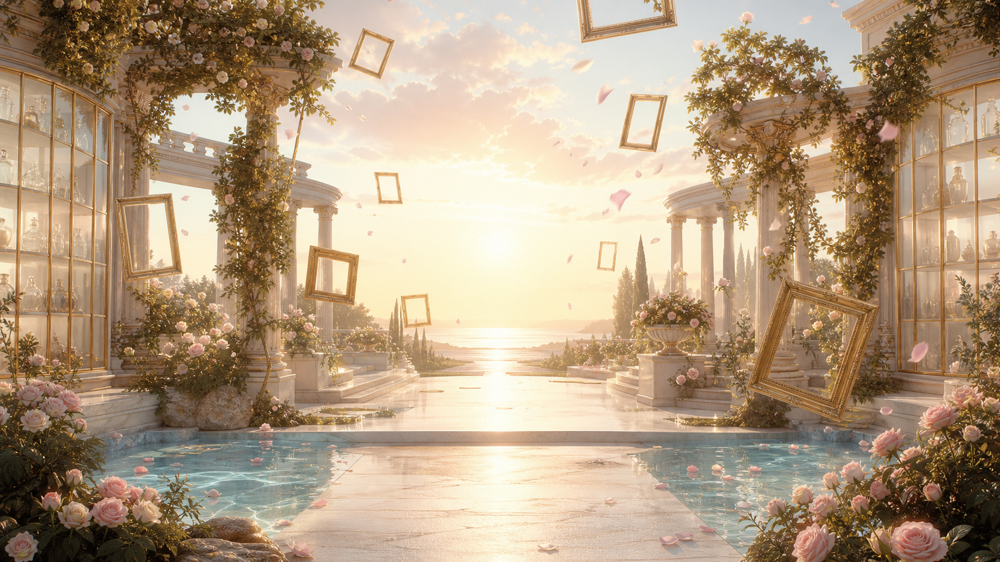
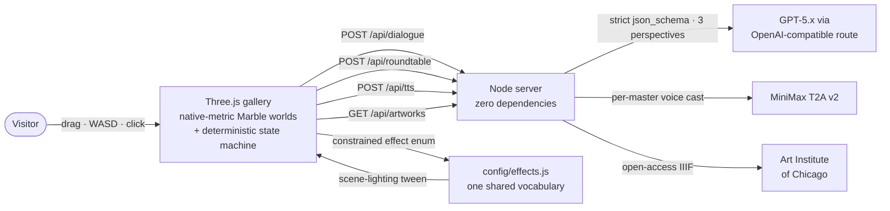

<div align="center">


<h1>MUSE∞ · The Impossible Museum</h1>

**Ask one question. Walk through the museum it becomes.**
A playable, AI-native dream museum: your question curates the collection, AI masters
walk beside you and argue about every painting in their own voices, and at the end the
walk you *actually took* is synthesised into a world that exists only for you.

[](https://sensai.devpost.com)
[](https://www.worldlabs.ai)
[](https://www.tripo3d.ai)
[](https://www.minimax.io)
[](#%EF%B8%8F-architecture)
[](https://www.artic.edu/open-access)
[](LICENSE)
[](#%EF%B8%8F-built-with)

</div>

---

## 🎬 The 60-second story

You arrive with one existential question — *"What makes a life meaningful?"* — and the
museum builds itself around it. You pick three masters (Monet, Van Gogh, Socrates…)
and step into a **walkable, AI-generated 3D world** where real public-domain paintings
hang on the walls. Click one and it becomes a **game dialogue**: a master opens in
character, you answer, another master answers *you* — then all three deliver **live,
parallel LLM readings of that exact painting**, each in their own cast voice, while the
room's light literally changes with each reading. When you're done walking, the masters
hold a **closing roundtable about the walk you actually took** — the paintings you
stopped at, the questions you asked — and name the world your choices built. Then you
step into it.

<div align="center">
<table><tr>
<td></td>
<td></td>
<td></td>
<td></td>
</tr></table>

*Four of the ten World Labs Marble worlds generated for MUSE∞ — every one walkable,
collider-grounded, and rendered at native metric scale.*
</div>

---

## 🎮 How to play

### Act I — One question opens the gate

Type (or pick) the question you actually carry. The museum reads it and starts
curating: palette, worlds, collection, companions.

### Act II — Choose your world and your minds

<div align="center">
<table><tr>
<td></td>
<td></td>
<td></td>
<td></td>
</tr></table>
</div>

Six Marble worlds sit on the chooser — and **three more are deliberately hidden**:
finale-only spaces, reserved as the exclusive destinations your philosophy can unlock.
Then invite up to three companions from seven masters, each built from documented
public-domain portraits into a full 3D figure via **Tripo**.

<div align="center">


*The masters don't sit in a chat panel. They stand in the world, walk with you,
and are clickable.*
</div>

### Act III — Walk. Really walk.

Drag to look, `W A S D` to move. The Marble world streams in behind a dark veil (no
placeholder flash), your feet snap to the real collider ground, and open-access
masterpieces from the Art Institute of Chicago hang on genuine display walls,
each with title, date, source and rights.

### Act IV — Every painting is an encounter

Click a painting and a **visual-novel dialogue** rises: a master opens *in
character* about this exact work (typewriter text, skippable), you choose your
answer, and a different master responds to *you*. Seconds later the **live layer**
lands: three parallel LLM readings of the painting — grounded in its real metadata,
strictly schema-validated, each labeled `LIVE`, each carrying its own
AI-interpretation disclaimer — and each reading re-lights the room through a
constrained effect vocabulary. Click a **master** instead and you can ask them
anything; all three answer in their own voice, never each other's.

Flip the **SOUND** toggle and it plays like a game: each master speaks with a
distinct MiniMax-cast voice (Socrates is a deep British gentleman; Van Gogh burns),
while a per-act public-domain score — Mussorgsky's *Promenade* for the overture,
Debussy for the gallery, Satie for the salon — **ducks under every spoken line and
swells back after it**.

<div align="center">

</div>

### Act V — The roundtable that read your walk

Your answers feed a philosophy meter (perception / emotion / invention). At the
end, the masters hold a closing roundtable **about your actual trajectory** — it
quotes the paintings you stopped at and the questions you asked, refuses to invent
stops you never made, and names the world your walk built. One click later you are
standing inside it: a finale-only Marble world the chooser never offered, hung with
a collection matched to your philosophy.

<div align="center">
<table><tr>
<td></td>
<td></td>
</tr></table>

*The synthesis is yours: same product, different walk, different world.*
</div>

---

## ✨ What makes it interesting

| | |
|---|---|
| 🌍 **Real generated worlds, walked natively** | Ten World Labs Marble worlds rendered at **native metric scale** (no bounding-box renormalisation): baked transforms, collider-driven ground snapping and walk bounds, per-world tuning. The official Marble viewer look — but playable. |
| 🎭 **Three minds, not one chatbot** | One question returns **three parallel readings** in a single strict-JSON LLM call — per-master authored lenses, quarantined vocabularies (Monet may not borrow Van Gogh's words), positional speaker reconciliation. Divergence is engineered, not hoped for. |
| 🗣️ **A cast, not a TTS** | Seven masters, seven MiniMax voices chosen from the live voice catalogue. Sentence-segmented narration advances only on the previous segment's `ended` event — no mid-line cut-offs — with one-segment prefetch (no dead air) and a watchdog (no stuck queue). |
| 🎼 **A score that knows when to be quiet** | Per-act public-domain recordings — Mussorgsky's *Promenade* is literally music about walking an exhibition. Game-style ducking drops the score under any speaking master in ~0.6 s. |
| 🧠 **The ending is earned** | The closing roundtable is grounded in a capped, server-re-clamped digest of your real session — visited artworks, asked questions, what each master already told you. Walk differently, get a different world. |
| 🧯 **Honest by construction** | No canned prose behind an HTTP 200. Live replies are labeled `LIVE`; fallbacks say so on screen; failures return real errors with reasons. The static server whitelists public files and never serves `.env`, tests, or docs. |

---

## 🏗️ Architecture



- **One effect vocabulary** (`config/effects.js`) feeds both the server's JSON-schema
  enum and the renderer's lighting targets — the two sides cannot drift apart.
- **Session digest** is capped at construction client-side *and* re-clamped
  server-side: a trust boundary, not a hope.
- Worlds are local `.spz`/`.glb` assets generated ahead of time with Marble —
  the judging path never depends on a paid call succeeding.

## 🛠️ Built with

| Tool | Role |
|------|------|
| [**World Labs Marble**](https://www.worldlabs.ai) | All ten walkable worlds — generated from authored prompts + reference images, rendered natively as splat + collider pairs. |
| [**Tripo**](https://www.tripo3d.ai) | The masters' 3D bodies — multiview turnaround sheets → reviewed GLB companions that walk with the visitor. |
| [**MiniMax**](https://www.minimax.io) | `speech-2.8-turbo` per-master narration — seven voices cast from the live catalogue. |
| **GPT-5.x** (OpenAI-compatible route) | Three-perspective artwork readings and the closing roundtable — strict `json_schema`, bounded retry, honest 502s. |
| [**Art Institute of Chicago Open Access**](https://www.artic.edu/open-access) | Every painting on the walls, with title/date/source/rights intact. |
| [**Three.js**](https://threejs.org) | Rendering, raycasting, collider walking. Everything else is **vanilla JS, zero build step**. |

## 🚀 Run it

Requirements: Node.js 20+.

```bash
npm start          # serves http://localhost:4173
npm run check      # syntax gate over every runtime file
npm test           # API contracts + public-surface/secret boundaries
```

| `.env` (all optional) | Unlocks |
|---|---|
| `LLM_API_KEY` / `LLM_BASE_URL` / `LLM_MODEL` | Live three-perspective dialogue + roundtable (labeled `LIVE`) |
| `MINIMAX_API_KEY` | Per-master voice narration behind the SOUND toggle |
| *(nothing)* | The full walk still works — with clearly labeled local fallbacks |

**Controls:** drag to look · `W A S D` walk · click paintings & masters ·
**SOUND** toggle (top right) for voices + score · `1–7` jump between acts ·
`R` reset · `P` performance tier.

## 🛡️ Rights & representation

- Historical figures are **explicitly interpretive AI perspectives** — every
  attributed line carries a visible disclaimer; no quotation, no endorsement, no
  voice cloning of real people.
- Artworks: public-domain / open-access records only, always with source and rights.
- Music: public-domain recordings. Voices: synthetic casting.
  Everything bundled is itemised in [`THIRD_PARTY_NOTICES.md`](THIRD_PARTY_NOTICES.md).
- No accounts, no personal data, no tracking.

## 🏁 SensAI · WORLDS IN ACTION [02] — SIGGRAPH LA

Built during the 48-hour hack, targeting **T2 World Labs** (flagship — ten Marble
worlds, walked natively), **T1 Storytelling** (the roundtable that reads your walk),
and **T3 Tripo** (the masters' 3D bodies). The product was pair-built with AI coding
agents (Codex + Claude) under human product direction; the engineer-facing spec lives
in [`docs/LATEST_PRODUCT_SPEC.md`](docs/LATEST_PRODUCT_SPEC.md), and the full QA
trail (15 acceptance-inspection reports) in [`docs/acceptance/`](docs/acceptance/).

Released under the [MIT License](LICENSE).

<div align="center">
<sub>MUSE∞ — because the best answer to a real question is a world you can walk through.</sub>
</div>
